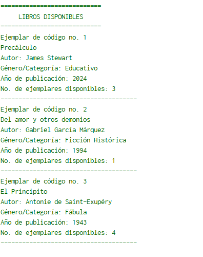
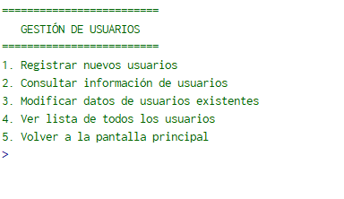
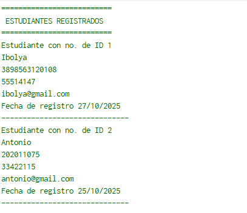
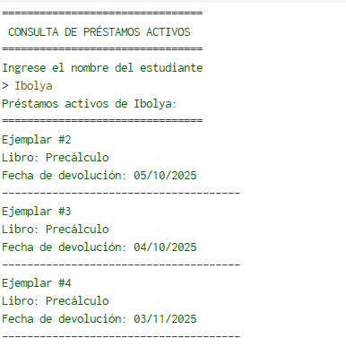

# Manual de Usuario

Para el manejo del sistema, es recomendable ingresar la información de la siguiente forma

* 1. Ingresar las ediciones de libros disponibles (inventario).
* 2. Registrar los usuarios.
* 3. Realizar el proceso de préstamos y devoluciones.

## Menú Principal

Por medio de este se ingresa a las principales funciones del sistema.

## Menú de Gestión de Libros

Con todas las funciones relacionadas al manejo de la información de los libros.

_- Listar Libros_

## Menú de Gestión de Usuarios

Con todas las funciones relacionadas al manejo de la información de los usuarios.

_- Listar Usuarios_

## Menú de Préstamos y Devoluciones

Con todas las funciones relacionadas a la salida de libros.

_- Listar préstamos_

